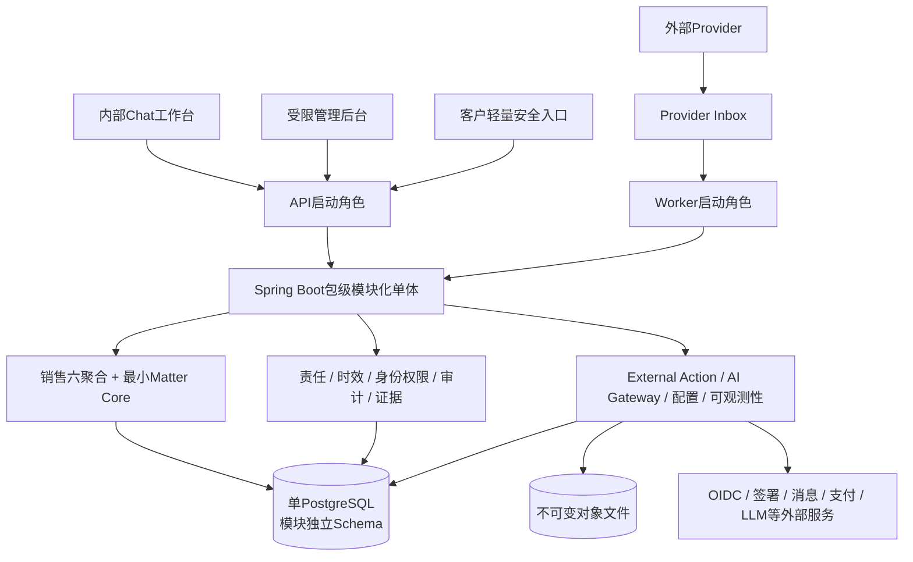

# Ontology Law System｜律所待办驱动智能管理系统

> 以本体定义业务事实，以责任内核生成待办，以一张可执行工作卡推动当前动作；普通内部用户只需要一个 Chat 工作台入口。

本仓库保存 Ontology Law System 的产品、领域、交互、架构、工程与 PostgreSQL 设计规格。当前阶段优先把设计边界冻结完整，尚未进入实施计划或生产代码建设。

## 1. 产品定位

Ontology Law System 不是把传统律所管理菜单搬进聊天窗口，也不是通用工作流平台。它采用以下最小闭环：

```text
领域事实变化
→ 版本化规则判断当前责任
→ 为准确Owner生成一个Task
→ Chat展示一张当前WorkCard
→ 用户确认确定性命令
→ 服务端鉴权、校验版本并写入唯一完成事实
→ 生成下一项责任或进入可证明的等待状态
```

- **本体是语义真源**：明确对象、关系、状态、事实、责任、证据与策略版本。
- **Task是责任投影**：每个Task只有一个当前Owner、一个主命令和一个准确完成事实。
- **Chat是交互壳**：一次只完整展开一张当前工作卡，只追问完成动作所缺的信息。
- **AI没有业务权力**：AI只能理解、提取、分类建议、解释和草拟；审批、核验、签署、付款确认、转案接收、分案及正式状态迁移仍由确定性用例和有权Actor完成。

## 2. 当前 MVP：销售至转案

销售MVP覆盖从线索进入到案管接收的业务闭环：

```text
线索导入/登记 → 去重与分配 → 首次联系 → 商机推进
→ 报价与冲突审查 → 合同、审批、签署/用印 → 执行条件与成交
→ 转案快照与案管审查 → 接收并原子创建正式最小Matter
```

销售至转案上下文当前包含六个业务聚合：

| 聚合 | 核心责任 |
|---|---|
| Party | 客户、联系人和主体身份 |
| Lead | 线索接入、去重、分配和首次联系 |
| Opportunity | 需求、商机推进、报价版本与客户商业回复 |
| ConflictReview | 冲突审查实例、Finding和有权决定 |
| Contract | 合同版本、审批、签署、用印、付款门槛和成交激活 |
| TransferRequest | 转案快照、材料条件、案管审查与接收 |

**这六个聚合只是“销售至转案上下文”的边界，不是整个律所系统永久只能有六个聚合。** Matter 登记、分类、分配、团队、办理内核，以及综法、非诉、诉讼、执行等案件类型能力包将在后MVP按正式接入契约扩展。

MVP的业务终点是：有权案管人员完成准确版本的转案接收决定，并在同一事务内形成`DecisionRecorded(TRANSFER_REVIEW, ACCEPT)`、`TransferAccepted`、`MatterCreated`和write-once `MatterLink`。Matter Core只保存正式Matter身份及其采纳的不可变转案来源，不复制客户、合同、材料或案件办理状态。

## 3. 极简用户体验

| 用户/通道 | 面向用户的入口 | 系统只呈现什么 |
|---|---|---|
| 销售、主管、财务、行政、风险、案管 | 内部统一Chat工作台 | 当前最值得处理的一张WorkCard、必要上下文和提醒 |
| 律所管理员 | 独立受限管理后台 | 用户、组织、任职、授权、代理、策略分配和审计查询 |
| 客户 | 轻量安全入口 | 被明确授予的材料、确认或签署动作 |
| 外部Provider | 隔离的Provider Ingress | 验真回执，不进入用户Chat或内部命令通道 |

一卡多态固定覆盖`ACTIONABLE / FORM / CONFIRM / SUBMITTING / WAITING / BLOCKED / RECOVERY / COMPLETED`等视图状态；状态在原卡原地更新，不把后台状态机和表单复杂度泄漏给用户。

提醒不是独立消息风暴。系统根据冻结的`TemporalPolicySnapshot`、优先级、风险、承诺时间和等待回执，更新当前卡与队列；`Task WAITING`与`WaitReceipt`严格分离，前者表示原责任安全暂停，后者证明正在等待谁、什么结果以及何时升级。

## 4. 总体架构基线



关键技术选择：

| 维度 | 已确认基线 |
|---|---|
| 部署与租户 | 逻辑多租户，初期单律所部署 |
| 后端 | 单个Spring Boot工程、一个构建产物、API/Worker两种互斥启动角色 |
| 模块 | 领域边界模块化单体；`api + internal`强边界；Spring Modulith验证依赖图，ArchUnit验证横切禁令 |
| 用例与事务 | 事实起点模块拥有具名原子用例；极薄CommandRuntime开启唯一外层短事务 |
| 数据库 | 单PostgreSQL；模块独立Schema；jOOQ唯一持久化范式；Flyway唯一DDL真源 |
| 前端 | npm workspaces；内部、管理、客户三个自治SPA；只共享纯UI包 |
| API | Internal、Admin、Customer、Provider四份契约优先OpenAPI，通道隔离 |
| 权限 | OIDC负责认证凭据；内部用户与权限内建；四轴授权、范围化授权、限制优先、职责分离和高风险双人复核 |
| 任务与决定 | 代码静态注册TaskDefinition；一个准确完成事实；类型化不可变Decision；授权依据固化 |
| 时效 | 代码版本化TemporalPolicy；Task创建时冻结时间快照 |
| 外部动作 | ExternalAction意图、Outbox单次派发、Provider Inbox、`UNKNOWN`恢复和RecoveryEpisode |
| 证据 | 关系元数据与不可变对象文件分离；UploadSession隔离入库；Retention/Hold/双人复核销毁 |
| AI | 类型化AI Gateway、静态只读工具、不可变Candidate、人工确认后才可形成正式命令 |
| 发布 | 单版本受控切换；Expand–Migrate–Contract；不可变RegistryManifest；ChangeGate/ReleaseGate两级门禁 |
| 容量 | C1中型单律所可验证容量包络，命中证据触发条件后再升级架构 |

## 5. 必须长期成立的不变量

1. 所有租户数据访问都使用强制Tenant Predicate与含`tenant_id`的复合约束；查询结果返回前再次做权威授权。
2. 正式写操作只能通过四类互斥的类型化命令信封进入CommandRuntime；Provider止步Inbox，AI止步Candidate。
3. 一个Task只由其`CompletionContract`登记的准确事实完成；聊天文案、按钮点击、外部回调或最终对象都不能冒充完成事实。
4. 每个命令以PostgreSQL持久化幂等并形成不可变`CommandReceipt`；结果未知时先查询Receipt，不能盲目重发。
5. 聚合当前状态、追加式`DomainEvent`和双Outbox在同一短事务内提交；MVP用PostgreSQL工作队列和Worker轮询，不引入Kafka。
6. 模块只能写自己的Schema和事实；跨Schema强外键只允许封闭白名单，跨模块行为通过具名Port、Query Facade或受限领域事件完成。
7. AI、前端、管理员、Worker和外部Provider都不能绕过事实Owner、版本校验、权限门禁、职责分离与审计。
8. 历史Task、Event、Decision、TemporalSnapshot、Evidence和Registry定义必须绑定准确版本，并在发布升级后继续可解释。

## 6. 规格阅读顺序与状态

发生冲突时，领域事实、MVP范围、责任与Matter边界服从上游领域规格；技术结构、构建与数据库约束分别服从其下游冻结规格。既有代码、旧数据表和高保真原型均不是兼容性基线。

| 顺序 | 规格 | 当前文档状态 | 解决的问题 |
|---:|---|---|---|
| 1 | [目标产品基线 v2.0](docs/specs/2026-08-17-law-firm-ontology-todo-chatbot-design.md) | 正式目标产品基线 | 产品原则、六聚合、责任内核、一卡多态与非目标 |
| 2 | [总体架构与本体完整设计 v1.0](docs/specs/2026-08-18-law-firm-overall-architecture-ontology-design.md) | 已冻结设计汇总，待用户复核文档 | 上下文边界、总体本体、主因果链与范围裁决 |
| 3 | [销售MVP工作卡与对话状态设计 v1.0](docs/specs/2026-08-17-law-firm-sales-mvp-workcard-dialogue-design.md) | 评审稿 | 工作卡、对话状态、提醒、异常、降级和交互验收 |
| 4 | [最小Matter身份与后MVP扩展契约 v1.0](docs/specs/2026-08-18-minimal-matter-identity-post-mvp-extension-contract-v1.0.md) | FROZEN | 销售终点、Matter原子创建及后MVP接入缝 |
| 5 | [基础框架设计规格 v1.0](docs/specs/2026-08-18-ontology-law-system-foundation-architecture-v1.0.md) | 正式冻结版 | 运行拓扑、权限、命令、责任、证据、AI、发布和质量门禁 |
| 6 | [项目结构、模块边界与构建契约 v1.0](docs/specs/2026-08-18-ontology-law-system-project-module-build-contract-v1.0.md) | 正式冻结版 | 仓库/包边界、依赖、角色装配、生成链、测试与ChangeGate |
| 7 | [PostgreSQL物理模型总纲 v1.0](docs/specs/2026-08-19-ontology-law-system-postgresql-physical-model-guideline-v1.0.md) | 正式冻结版 | Tenant、类型、Schema、映射、事务、安全、迁移、索引与容量 |

## 7. 当前范围与明确非目标

当前仓库是**设计规格仓库**。本阶段不直接产出实施排期、完整DDL、逐字段OpenAPI或生产应用骨架。

MVP明确不做：

- Matter登记、分类、分配、承办团队、法律期限、办理流程、工作成果与结案。
- 综法、非诉、诉讼、执行等案件类型能力包的实现。
- 完整财务总账、开票、退款、冲正、佣金与跨合同资金分配；法律业务财务内建，会计总账未来外接。
- 通用Todo、BPMN/流程设计器、动态规则DSL、运行时本体平台、EAV或以RDF/图数据库作为MVP前提。
- 微服务、Kafka、外置搜索、读副本、默认分区、全量CQRS或事件溯源平台。
- 在Matter创建后提前生成登记、分配或案件办理Task。
- 已明确暂缓的备份与灾难恢复框架。

这些能力可以在未来通过Matter接入契约、能力Owner端口、版本化策略包和新增聚合扩展，但不得以预留字段、通用JSON扩展、空模块或动态Handler提前进入MVP。

## 8. 下一层设计方向

在不进入实施计划的前提下，后续按依赖顺序继续细化：

1. `platform_meta`与共享数据库类型的可执行物理契约。
2. `identity_access`的Tenant、Actor Binding、Authorization Fence和权威查询授权模型。
3. `execution_runtime`、`responsibility`与`temporal`的详细状态、端口、表和并发协议。
4. Audit、Configuration、Evidence与External Action的平台Schema细册。
5. 六个销售聚合及最小Matter Core的Owner Schema细册。
6. 四通道OpenAPI字段契约、Provider协议、SPA状态边界与测试Fixture。

每一层仍以“用户尽可能简单、内核责任最小、事实与权力边界可证明”为冻结准则。

## 9. 仓库结构

```text
.
├── README.md
└── docs/
    └── specs/    # 已确认与评审中的设计规格
```

最后更新：2026-08-21。
