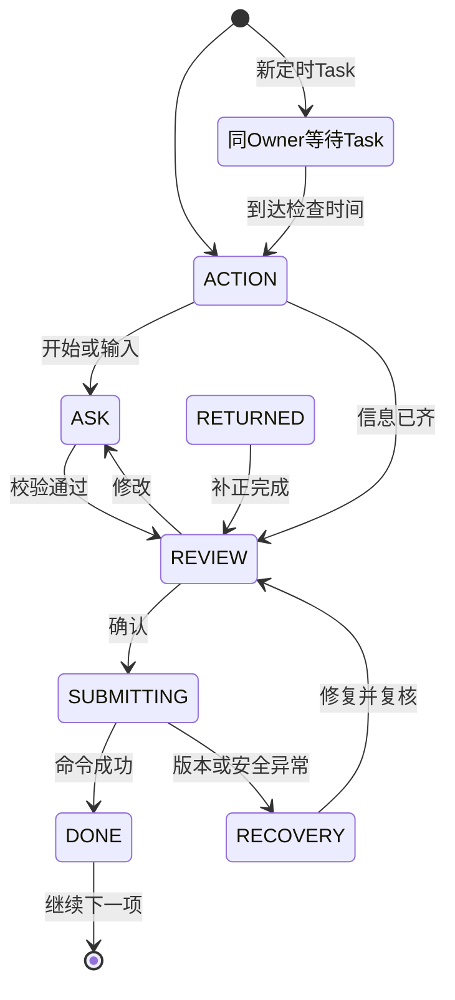

# 律所销售MVP：工作卡与对话状态设计

> [!WARNING]
> 历史规格（HISTORICAL_SUPERSEDED）。本文仅保留设计演进证据；与[当前MVP基线](../baseline/CURRENT-MVP-BASELINE.md)冲突时，当前基线及52＋2合同优先。本文不得作为新实现或DDL生成依据。

历史元数据（原版本）：1.0
日期：2026-08-17  
历史元数据（原状态）：评审稿
上位规格：《律所待办驱动智能管理系统：目标产品基线》2.0

## 1. 设计目标

本规格把销售从线索接入到案管接收的责任链，转换为普通用户只需学习一次的交互：

- 一个响应式Chat入口。
- 一张置顶且原地更新的WorkCard。
- 一个支持文字、语音、图片和附件的输入框。
- 一次只解决当前责任。

WorkCard不是传统表单的聊天包装。它只展示当前动作所需的最小信息；复杂对象、状态、审批矩阵、冲突Finding、版本和审计记录均由后端管理。

## 2. 成功标准

销售第一次使用时，无需学习菜单、对象模型或流程图，能够回答：

1. 我现在最该做什么。
2. 为什么现在需要做。
3. 还缺什么。
4. 做完后会发生什么。
5. 如果正在等待，谁在处理、何时反馈、我是否还需要行动。

所有高频任务的预定义正常路径必须满足：

- 一张卡、一个主命令。
- 每轮默认一个问题。
- 全程最多五个净新增值。
- 最多三次用户提交。
- 常规任务最多一次显式确认。
- 零业务页面跳转。

## 3. Chat壳结构

### 3.1 首页

| 区域 | 内容 | 约束 |
|---|---|---|
| 今日摘要 | 一句话，例如“今天有3件事，先联系王某” | 不放KPI和图表 |
| 当前工作卡 | 当前最高优先级责任 | 只完整显示一张 |
| 后续摘要 | 最多两条标题和截止时间 | 不提供操作按钮 |
| 等待计数 | “等待中4项” | 点击后只显示WaitReceipt与只读WAITING Task摘要，不进入业务列表 |
| 对话区 | 当前任务相关的必要消息 | 不把每个状态生成新卡片 |
| 输入框 | 文字、语音、图片、附件 | 所有输入共用一个入口 |
| 队列入口 | 当前、后续、等待三个轻量分组 | 不出现筛选器、列配置和分页 |

“全部待办、最近客户、历史对话”不作为首页固定入口。用户可以直接问“我还有什么事”“查一下王某”“刚才的报价是什么”。

### 3.2 当前卡位置

- WorkCard固定在输入框上方。
- 同一taskId只能渲染一个当前卡实例。
- 状态推进时原地更新，不能向聊天记录继续追加完整卡。
- 命令成功后，当前WorkCard进入DONE并保持可见，直到用户点击“继续下一项”或离开页面。
- 点击“继续下一项”后，DONE折叠为一条结果记录，下一Task才占据唯一当前卡槽；该导航不计入已完成Task的提交预算。
- 浏览历史消息不会改变当前卡绑定的taskId。

## 4. WorkCard统一结构

### 4.1 可见结构

| 顺序 | 元素 | 可见上限 |
|---:|---|---:|
| 1 | 动作标题 | 一行，必须使用准确动词 |
| 2 | 客户/业务对象自然名称 | 一行 |
| 3 | 截止或等待状态 | 一行 |
| 4 | 任务说明 | 一句话 |
| 5 | 关键事实 | 最多四项 |
| 6 | 当前问题或变化摘要 | 最多三项 |
| 7 | 主操作 | 一个 |
| 8 | 非破坏性次操作 | 最多一个 |
| 9 | 为什么/操作记录 | 默认折叠 |

卡片除按钮外的全部可见文本最多六个自然行，并按状态分配预算：

- ACTION：标题、对象、状态和最多三项事实。
- ASK：标题、对象、状态、一个问题和最多两行候选摘要。
- REVIEW：标题、对象、状态和最多三条变化；普通facts在此状态隐藏。
- WAITING、RECOVERY、DONE：标题、对象、状态和最多三行结果说明。

逐任务表中的“首屏事实”只是候选池，不表示同时渲染。任何状态最多展示三项事实，不得同时显示facts和三条变化；“任务说明”若出现也占用同一六行预算，并替换最低优先级事实。不允许卡内滚动，溢出内容只能进入折叠的“为什么/操作记录”。证据、置信度、规则版本、对象ID和审计编号默认不展示。

补充状态预算：SUBMITTING只显示标题、对象、状态和一行进度；RETURNED显示标题、对象、状态、第一条退回项和当前问题；CANCELLED显示标题、对象、状态、取消原因和替代责任摘要。以上均不得超过六行。

### 4.2 服务端卡片契约

| 字段 | 含义 | 所有权 |
|---|---|---|
| cardKind | TASK或WAIT_RECEIPT，作为判别字段 | 服务端 |
| cardId | 当前可见卡标识 | 服务端 |
| taskId/receiptId | 按cardKind二选一，禁止同时存在 | 服务端 |
| subjectRef/subjectVersion | 绑定业务对象及版本 | 服务端 |
| title/subjectLabel | 用户可读动作和对象名称 | 服务端模板 |
| viewState | ACTION、ASK、REVIEW等视图状态 | 编排层 |
| taskStatus | OPEN、WAITING、DONE、CANCELLED | 责任内核 |
| deadlineLabel/statusLabel | 截止和当前状态 | 确定性策略 |
| facts | 最多四项已知事实 | 领域查询 |
| question | 当前唯一问题 | 编排层 |
| options | 最多三个封闭选项 | 领域命令定义 |
| missingCount | 当前仍缺多少项 | 确定性校验 |
| primaryAction | 当前唯一主命令的准确动词 | 服务端权限裁决 |
| viewAction | BEGIN、ANSWER、MODIFY等不写业务事实的视图动作 | 编排层 |
| commandVariant | Task创建时固定的主命令变体，生命周期内不得改变 | 责任内核 |
| secondaryAction | 修改Draft、查看原因等纯视图动作；不得写Task状态或业务事实 | 服务端 |
| explanation | 为什么出现、怎样完成、完成后发生什么 | 服务端事实与策略 |
| allowedInput | 文字、语音、图片、附件的允许集合 | 任务类型 |
| riskLevel | L0至L3 | 固定命令定义 |
| draftVersion | 当前草稿版本 | 编排层 |
| confirmationToken | 绑定Actor、Task、对象版本、命令和载荷哈希 | 服务端 |

前端和LLM不得自行增加按钮、修改primaryAction或改变allowedInput。

卡片契约必须实现为判别联合，而不是带大量可空字段的通用对象：

| cardKind | 必须存在 | 必须不存在 |
|---|---|---|
| TASK | cardId、taskId、taskStatus、commandVariant；可执行状态有primaryAction | receiptId |
| WAIT_RECEIPT | cardId、receiptId、receiptStatus、subjectRef、title、statusLabel、facts、explanation | taskId、taskStatus、viewState、commandVariant、primaryAction、viewAction、secondaryAction、question、options、missingCount、allowedInput、riskLevel、draftVersion、confirmationToken |

WaitReceipt不能被前端强制转换为WAITING Task、进入WorkCard状态机或借用Task按钮。TASK卡在DONE后仍保留taskId和结果，但不再接受原主命令。

“开始处理、回答问题、修改草稿”只是viewAction，不是primaryCommand。若创建报价草稿后需要在“发送”和“提交审批”之间分支，前一个Task先由CREATE_QUOTE_REVISION完成，再由Event生成固定ISSUE_QUOTE或REQUEST_QUOTE_APPROVAL的新Task；WorkCard可原地换绑，但taskId和confirmationToken必须更新。

## 5. WorkCard视图状态

### 5.1 状态定义

| 状态 | 用户看到 | 允许操作 | 退出条件 |
|---|---|---|---|
| ACTION | 动作、对象、截止时间和一个主按钮 | 开始处理；必要时查看原因 | 用户开始或直接输入结果 |
| ASK | 当前唯一问题、已有候选值 | 回答、上传或选择；最多一个修改入口 | 当前问题已满足或明确不知道 |
| REVIEW | 最多三条关键变化和准确提交动词 | 确认；修改 | 获取有效确认令牌并提交 |
| SUBMITTING | “正在处理”，按钮锁定 | 无重复提交 | 得到确定结果、UNKNOWN或失败 |
| WAITING | 等待原因、当前责任以及内部SLA或本人的nextCheckAt；客户等待不承诺反馈时间 | 只查看最小进度 | 权威结果、退回或下一检查时间到达 |
| RETURNED | 第一条明确退回项 | 直接修正当前项 | 所有退回项修正完成 |
| RECOVERY | 人类可理解的问题和安全恢复动作 | 修正一项、重试一次或等待核验 | 原问题消失 |
| DONE | 业务结果和下一步 | 继续下一项；查看操作记录 | 仅用户点击“继续下一项”或离开页面；计时器、回执或新Task不得自动退出DONE |
| CANCELLED | 取消原因和是否产生替代责任 | 继续下一项；查看原因 | 用户继续后折叠为结果记录 |

### 5.2 视图状态与Task状态

| Task状态 | 可出现的视图状态 |
|---|---|
| OPEN | ACTION、ASK、REVIEW、SUBMITTING、RETURNED、RECOVERY |
| WAITING | WAITING；仅限新建的同Owner定时Task，或SYSTEM_RECOVERY安全暂停 |
| DONE | DONE |
| CANCELLED | CANCELLED |

内部角色接手时，销售Task应结束为DONE，并生成只读WaitReceipt；不把销售Task长期挂在WAITING。WAITING Task只用于“仍由同一Owner负责、但当前尚无可执行动作”的情况。

审批驳回、合同退回和转案退回不得重新打开已经DONE的Task。退回Event生成新的修正Task实例和新taskId；WorkCard可以在同一视觉位置显示RETURNED，但责任记录保持追加和不可变。

新修正Task保存predecessorTaskId、原对象版本以及已接受的Draft/Evidence。DONE Task永不重新变为OPEN。

原Task不得通过“稍后、改期、不知道”等次操作以同一taskId进入WAITING。客户承诺等正常业务输入必须先以当前Task的固定完成事实结束当前责任，再由该Event按未来要承担的动作选择并固定新commandVariant后创建WAITING occurrence；记录签署或付款承诺后，后续通常是SEND_SIGNATURE_REMINDER、SEND_PAYMENT_REMINDER或策略定义的检查动作，不能再次沿用RECORD_SIGNATURE_COMMITMENT或RECORD_PAYMENT_PROMISE。确实无法继续时，确定性政策取消原Task并创建新的WAITING Task或人工核验责任；如用户主动要求改期，Chat先生成一张绑定准确对象的单命令调整卡，确认产生领域Event后再取消旧WAITING occurrence并创建新occurrence。AI不能直接改期、取消或复用Task。

### 5.3 状态转换

| 当前状态 | 触发 | 下一状态 | 业务副作用 |
|---|---|---|---|
| ACTION | 点击主操作或输入结果 | ASK或REVIEW | 创建或恢复ActionDraft |
| ASK | 回答有效 | ASK或REVIEW | 只更新Draft，不写业务事实 |
| ASK | 回答“不知道” | ASK、RECOVERY或CANCELLED | 可跳过则继续；不能安全完成时移交人工核验，或由确定性政策取消原Task并创建新的WAITING occurrence |
| REVIEW | 点击修改 | ASK | 保留已填值并定位第一处修改 |
| REVIEW | 确认有效 | SUBMITTING | 使用一次性确认令牌执行命令 |
| SUBMITTING | 命令成功 | DONE | 原子写业务事实、Event/Decision和Task结果；若已生成后续WAITING Task或WaitReceipt，只在DONE中提示“下一项或等待回执已准备好” |
| SUBMITTING | 对象版本变化 | RECOVERY | 不写事实，重新加载差异 |
| SUBMITTING | ExternalActionRequested已持久化 | DONE | 人工Task完成并创建独立WaitReceipt，禁止重复提交，由Worker派发或核验 |
| 新WAITING Task | nextCheckAt到达 | ACTION | 同一taskId由确定性调度转为OPEN，开始计算Owner动作SLA |
| RETURNED | 当前退回项修正 | RETURNED、REVIEW | 逐项推进，不新建第二张补正卡 |
| RECOVERY | 问题已修复 | 原状态 | 保留Draft和附件 |
| 任一非终态 | 权威取消/替代事实 | CANCELLED | 记录原因并取消原确认令牌；如有替代责任则生成新Task摘要 |

WaitReceipt不在此WorkCard状态图内。回执结果只更新“等待中”区域；若需要用户补正，则创建全新taskId并进入优先队列，不能抢占仍在等待用户点击“继续下一项”的DONE卡。

## 6. 对话状态与草稿

### 6.1 ActionDraft

每次处理任务创建一个ActionDraft，只保存候选输入，不是业务事实。

ActionDraft至少包含：

- actorRef、taskId、subjectRef和subjectVersion。
- 当前viewState和当前问题。
- 已知事实快照。
- 候选值、来源和是否被用户修正。
- Evidence临时引用。
- 已经消耗的用户提交次数和净新增值数量。
- draftVersion、创建时间和最后活动时间。

刷新页面、网络中断、AI切换为降级模式后必须恢复同一ActionDraft。

### 6.2 候选值状态

| 状态 | 含义 | 是否可写业务事实 |
|---|---|---|
| EXTRACTED | AI或OCR提取，用户尚未看到 | 否 |
| PRESENTED | 已在问题或摘要中呈现 | 否 |
| USER_CORRECTED | 用户明确修正 | 仅在命令提交后 |
| CONFIRMED | 已包含在本次确认载荷 | 仅在命令成功后 |
| REJECTED | 用户否认 | 否 |

系统不向普通用户展示数值置信度。低置信度通过自然语言询问，高置信度仍只是候选值。

### 6.3 对话轮次规则

- 一个聊天气泡只能提出一个问题。
- 只有用户能用一句自然语言同时回答时，问题才可包含最多三个紧密相关值。
- 同屏可见快捷选项总数最多三个，且包含“不知道/其他”等兜底项；自由输入始终复用唯一composer，不新增字段或第四个chip。
- 同一任务最多一次对象消歧，候选最多三个。
- 无上下文自由输入发生真实歧义时才出现ChoiceSheet。
- 从提醒、工作卡或对象结果进入时，不得再次询问“哪个客户”。
- 用户主动提供超出当前问题的信息时，可保存为候选，但不得擅自执行第二个命令。

预算口径：

- “用户提交”指任何推进视图或表达用户意图的动作，包括点击主按钮、选择一个选项、发送一次文字/语音、完成一次批量上传和最终确认。
- 打开卡片、滚动、展开“为什么”和查看只读证据不计提交。
- 一次批量选择文件计一次提交；局部上传失败后的逐文件重试不计正常路径预算，但单独统计恢复次数。
- “净新增值”指命令Schema中的原子字段。不得把“客户信息、付款安排、主体信息”等对象包装为一个值。
- 系统自动提取且用户无需修正的字段不计净新增值；用户主动提供或修正的每个原子字段计一个。
- 只要任务存在待问字段，打开后直接进入ASK；BEGIN不得作为ASK前的必经提交。ACTION只用于必须先完成通话、阅读或取得材料等线下动作的任务。
- 五个净新增值必须能在最多两次自然语言或批量输入中提供，再用一次确认完成；不得用字段逐问造成第四次正常提交。
- ACTION路径中的低置信候选必须在同一次可修正REVIEW中以内联值呈现，用户可修正后直接点击准确确认动词；不得强制先点“修改”返回ASK而制造第四次提交。

固定高频旅程为：首联/重试、商机推进、报价、冲突主体补充、合同准备、签署跟进、首款跟进、转案提交/补正八类。每类验收样本不少于20个实例，并覆盖正常、缺信息、低置信度和退回/恢复场景；不得只计算总体平均值。

每类预定义正常路径fixture必须100%在三次提交内完成；“80%在三次内”只用于真实生产分布指标，不得放宽fixture。AI降级是唯一允许的正常路径例外，且最多增加一次提交。

### 6.4 问题选择顺序

编排层按以下顺序选择下一个问题：

1. 阻止当前主命令执行的必要字段。
2. 高风险且无法从证据可靠推断的字段。
3. 能够一次减少最多后续问题的字段。
4. 其余可后补字段。

若预计仍需用户补充超过五个净新增值，系统必须优先从已有资料提取、调用受控查询或把任务拆成明确的后续责任；禁止继续追问。

## 7. 确认与风险分级

| 风险 | 示例 | 确认方式 |
|---|---|---|
| L0 | 查询、摘要、查看等待状态 | 不确认 |
| L1 | 保存可逆沟通结果、内部备注 | 单值明确表达可直接执行；提取出多个候选值时进入REVIEW，完成后允许撤销 |
| L2 | 改变业务状态、对外发送报价/消息、提交审批 | REVIEW中显示对象、最多三条变化和副作用，点击准确动词确认 |
| L3 | 冲突豁免、合同批准、付款确认、退款、正式签章、转案接收 | 专用Decision卡、重新认证及职责分离；不能由AI代替 |

确认令牌：

- 有效期五分钟。
- 只能使用一次。
- 绑定Actor、Task、subjectVersion、primaryCommand和`payloadDigestRef`；该Digest Ref带算法与规范化Profile版本。
- 对象版本、权限或载荷变化后立即失效。
- 令牌失效只返回差异，不丢失Draft。

禁止使用泛化按钮“提交、确定、保存”。主按钮必须表达结果，例如：

- 保存联系结果。
- 提交报价审批。
- 发送报价给客户。
- 提交合同审批。
- 确认到账。
- 提交案管审核。
- 接收并建立案件。

## 8. 销售五种卡片模式与协作决定模式

用户始终看到相同WorkCard结构，模式只决定问题、输入和命令。

| 模式 | 适用任务 | 典型输入 | 典型主操作 |
|---|---|---|---|
| CONTACT | 首联、重试、实质进展、回访 | 语音、文字、通话证据 | 保存联系结果 |
| DRAFT | 报价、合同草案 | 文字、已有模板、附件 | 提交审批或发送准确版本 |
| DISCLOSE | 冲突主体补充 | 文字、证件/营业执照图片 | 提交冲突初筛 |
| FOLLOW | 签署、付款和客户承诺跟进 | 文字、截图、回单 | 发送提醒或记录承诺 |
| TRANSFER | 转案提交和退回补正 | 批量附件、语音说明 | 提交案管审核 |

协作角色使用同一WorkCard，并增加第六种DECISION模式；销售不会看到DECISION模式内部的审批矩阵和完整风险材料。

同一Task occurrence只绑定一个commandVariant和一个完成事实。FOLLOW模式中的“发送提醒、记录承诺、提交证据”，以及签署、付款的不同动作，必须各自生成独立Task，不能在同一Task内切换主命令。若新到达的客户消息使原OPEN Task不再适用，确定性路由器以“已有新事实”为原因取消原Task并创建正确变体的新Task；AI只能识别候选意图，不能自行取消或改绑Task。

完成Event只有同时匹配taskId或causationId、subjectRef和准确revision/hash时，才能关闭该Task。QuoteAuthorized、ConflictReviewResolved、ContractExecuted、DealActivated等后续业务事实，不能替代前置Task自己的完成事实。

DECISION模式只允许以下固定decisionKind：

| decisionKind | 锁定对象 | 合法结果 | 必填约束 |
|---|---|---|---|
| LEAD_VALIDITY_REVIEW | Lead版本 | INVALID、REOPEN | 理由 |
| LEAD_AUTOARCHIVE_RECHECK | Lead自动归档版本 | KEEP_ARCHIVED、REOPEN | 只能复查系统自动归档结果 |
| CONTACT_RETRY_BREACH_DISPOSITION | Lead及联系计划版本 | RETRY_SAME_OWNER、REASSIGN | 漏做窗口不能直接认定失联 |
| OPPORTUNITY_REJECTION_DISPOSITION | Opportunity及商业回复版本 | STOP_FOLLOW_UP、CONTINUE_SAME_OWNER_REVISED_PLAN、CONTINUE_NEW_OWNER_REVISED_PLAN | 仅用于客户明确拒绝合作 |
| QUOTE_DISCOUNT_APPROVAL | QuoteRevision及内容哈希 | APPROVE、REJECT | 驳回理由；超50%为两个不同Actor |
| CONFLICT_WAIVER | purpose、ConflictReview、Finding及scopeHash | WAIVE、BLOCK | 理由与有权风险角色 |
| CONTRACT_APPROVAL | ContractRevision及内容哈希 | APPROVE、REJECT | 固定authorizationScope；纯风险必须为PURE_RISK_ENGAGEMENT并记录有权合伙人角色 |
| PAYMENT_D15_DISPOSITION | PaymentGate及版本 | CONTINUE、TERMINATE | CONTINUE必须指定owner和nextCheckAt |
| TRANSFER_REVIEW | TransferSnapshot及版本 | ACCEPT、RETURN | RETURN必须列出具体缺项 |

MAKE_DECISION只由匹配同一taskId、decisionKind和subject版本的DecisionRecorded完成。

## 9. 入口：线索导入与分配

正常线索接入不应制造人工待办：

1. 渠道、受控导入或有权人员在Chat中录入最小线索。
2. 系统生成LeadCaptured，规范化联系方式和主体候选。
3. 关键字段完整且不存在重复风险时，按可用销售轮询自动分配。
4. 系统生成LeadAssigned，接单销售直接收到CONTACT_LEAD卡。

只有三类入口异常生成RESOLVE_LEAD_INGRESS卡：

| 异常 | Owner | 卡片标题 | 主操作 | 完成事实 |
|---|---|---|---|---|
| 疑似重复 | 来源负责人 | “确认王某是否为重复线索” | 关联同一主体 / 保持独立；选择后只保留对应准确按钮 | LeadDuplicateResolved |
| 关键数据缺失 | 来源负责人 | “补充王某线索的联系方式” | 保存入口信息 | LeadIngressCompleted |
| 无可用销售 | 销售主管 | “为王某指定接单人” | 指定接单人 | LeadAssigned |

重复处理只建立Party或Opportunity关联，不删除或覆盖原Lead来源记录。无人可分配时，候选销售最多显示三人，并只展示当前可用性和容量；主管选择后再出现“分配给张某”主按钮。

销售本人不处理导入、去重和分配过程；销售只从已经分配、可以立即行动的CONTACT_LEAD卡开始。

## 10. 阶段一：接单与判断

### 10.1 CONTACT_LEAD：首次联系

| 项目 | 设计 |
|---|---|
| 触发 | LeadAssigned |
| 标题 | “30分钟内联系王某” |
| 首屏事实 | 来源、进入时间、电话、剩余时间 |
| 视图动作 | 开始联系 |
| 固定主命令 | RECORD_CONTACT_RESULT，准确主操作为“保存联系结果” |
| 允许输入 | 通话、语音、文字 |
| 必要结果 | 已接通、未接通、疑似无效之一 |
| 接通缺失项 | 规范姓名、城市、法律诉求、是否到所；已有值不再询问 |
| REVIEW | 最多显示联系结果、诉求、下一动作三条变化 |
| 确认动词 | 保存联系结果 |
| 完成事实 | 仅ContactResultRecorded；有效时OpportunityOpened是同事务下游事实，不参与关闭本Task |
| 后续 | 未接通生成重试；疑似无效生成主管Decision；有效生成推进商机 |

对话示例：

| 状态 | 对话/卡片 |
|---|---|
| ACTION | 卡片：“30分钟内联系王某”，视图动作“开始联系”；用户已完成通话时可直接输入结果 |
| 用户输入 | “联系上了，在合肥，咨询劳动仲裁，明天下午来所里。” |
| ASK | 如果姓名已知，不再问；若到访具体时间不完整，只问“明天下午大约几点？” |
| REVIEW | “我将记录：合肥；劳动仲裁；明天15:00到访。保存后会创建来访跟进。” |
| 主操作 | 保存联系结果 |
| DONE | “联系结果已保存，来访跟进已安排在明天15:00。” |

### 10.2 CONTACT_LEAD：联系重试

同一taskType按创建前已确定的渠道拆为固定变体：

| commandVariant | 唯一主操作 | 唯一完成事实 | 后续 |
|---|---|---|---|
| RECORD_CONTACT_ATTEMPT | 记录本次拨打结果 | ContactAttemptRecorded，outcome为CONNECTED或NOT_CONNECTED | CONNECTED创建新taskId的RECORD_CONTACT_RESULT；NOT_CONNECTED按策略创建下一重试 |
| SEND_CONTACT_MESSAGE | 发送这条联系消息 | ExternalActionRequested | 供应商确认ContactMessageSent后才按策略创建下一联系occurrence |

- 卡片只显示本次建议时段、固定渠道和累计尝试次数。
- 系统自动记录时间、渠道和技术证据，不让用户重复填写。
- 创建Task前由确定性策略选定渠道；用户要求换渠道时取消原OPEN Task并创建固定新变体和新taskId，不能在原Task内切换。
- ContactAttemptRecorded(CONNECTED)只关闭尝试责任，不收集实质联系结果；新RECORD_CONTACT_RESULT Task复用已知上下文并按首次联系卡采集结果。
- 下一次重试只能由ContactAttemptRecorded(NOT_CONNECTED)或权威ContactMessageSent触发，不能由ExternalActionRequested发送意图提前触发。
- T+1/T+2早、中、晚的真实尝试由策略验证；未来Task在对应时段前保持WAITING，到时转为OPEN。

### 10.3 MAKE_DECISION：疑似无效复核

| 项目 | 设计 |
|---|---|
| Owner | 销售主管 |
| 标题 | “复核王某线索是否无效” |
| 首屏事实 | 销售判断、原因、联系证据、相似历史 |
| 主操作 | 开始复核 |
| DECISION选项 | 确认无效、重新开启；选择后卡片只保留对应准确主按钮 |
| 必填 | 理由码；重新开启时可指定下一责任时间 |
| 确认动词 | 确认无效并归档 / 重新开启首联 |
| 完成事实 | DecisionRecorded，decisionKind为LEAD_VALIDITY_REVIEW |

“开始复核”只是视图动作。该Task的固定主命令为RECORD_DECISION，只有绑定当前taskId、Lead版本和LEAD_VALIDITY_REVIEW的DecisionRecorded才能完成。

24小时超时按政策自动归档时，系统写入LeadAutoArchived Event，记录service actor、policyRef、输入事实和执行时间，并生成7日主管复查责任；不得生成或伪装成人工Decision。

## 11. 阶段二：推进委托

### 11.1 ADVANCE_OPPORTUNITY：记录实质进展

| 项目 | 设计 |
|---|---|
| 标题 | “推进王某的劳动仲裁委托” |
| 首屏事实 | 最近有效进展、客户承诺、已报价状态、剩余时间 |
| 主操作 | 记录进展 |
| 允许输入 | 文字、语音、录音、图片 |
| AI辅助 | 摘要、识别进展类型、提取下一承诺时间 |
| 有效进展 | 已接通电话、主动来访、面聊、已发送报价、外访、有效微信对话 |
| 无效进展 | 草稿、内部备注、未接通呼叫 |
| REVIEW | 进展类型、摘要、下一检查时间 |
| 确认动词 | 保存本次进展 |
| 完成事实 | ProgressRecorded |

如果用户说“客户下周回复”，系统只补问具体日期；ProgressRecorded完成当前Task，并创建新的ADVANCE_OPPORTUNITY occurrence。新Task以WAITING状态保存nextCheckAt，到期后转为OPEN；不得复用原Task或重置原SLA。

### 11.2 PREPARE_QUOTE：准备报价

| 项目 | 设计 |
|---|---|
| 标题 | “为王某准备报价” |
| 首屏事实 | 法律需求、推荐收费方式、参考价、当前审批权限 |
| 视图动作 | 准备报价 |
| 固定主命令 | CREATE_QUOTE_REVISION |
| 最多补充 | 服务范围、金额、收费类型、付款安排、有效期五类净新增值 |
| 自动预填 | 已确认需求、价目表、标准条款、折扣和税费计算 |
| REVIEW | 对客金额、收费方式、付款安排；详细条款折叠 |
| 确认动词 | 生成这份报价 |
| 完成事实 | QuoteRevisionCreated；这只是报价草案责任的完成事实，不代表已审批或已发送 |

QuoteRevisionCreated后由确定性权限规则生成新的PREPARE_QUOTE occurrence，且taskId、confirmationToken和commandVariant全部更新：

- 权限内：固定commandVariant为ISSUE_QUOTE，唯一主操作为“发送这份报价给客户”；ExternalActionRequested可靠持久化后完成人工Task，并创建只读WaitReceipt。
- 需要审批：固定commandVariant为REQUEST_QUOTE_APPROVAL，唯一主操作为“提交这份报价审批”，以QuoteApprovalRequested完成并生成只读WaitReceipt。
- 审批全部满足后产生QuoteAuthorized，再生成固定ISSUE_QUOTE的新Task；审批Task本身不能发送报价。
- 消息供应商权威确认后，同一回调事务才产生QuoteIssued，并绑定准确QuoteRevision、内容哈希、收件人和发送证据。草稿、审批通过、ExternalActionRequested或在聊天中展示报价都不等于已发送；QuoteIssued之前不得生成客户回复Task。

对话示例：

| 状态 | 对话/卡片 |
|---|---|
| ACTION | “为王某准备报价”，视图动作“准备报价” |
| ASK | “这次采用固定收费、半风险还是纯风险？” |
| 用户输入 | “固定收费，两万元，分两期，先付一半。” |
| REVIEW | “固定收费20,000元；首付10,000元、余款一个月内；当前优惠在你的权限内。” |
| 主操作 | 生成这份报价 |
| DONE | “报价已准备好。下一项是发送给客户。” |

### 11.3 MAKE_DECISION：报价审批

- 卡片锁定准确QuoteRevision和内容哈希。
- 首屏最多三项：标准价与对客价合并为一项，另显示优惠比例和主要依据。
- 审批人先选择批准或驳回，再出现准确主按钮。
- 驳回必须选择理由并可写一条修改建议。
- 超过50%优惠生成主任和合伙人两个独立Decision任务；两人必须是不同Actor。
- 所有Decision满足后才允许发送准确报价版本。
- 报价审批Task固定使用RECORD_DECISION，并只由绑定当前QuoteRevision、内容哈希和QUOTE_DISCOUNT_APPROVAL的DecisionRecorded完成；QuoteAuthorized不能替代该完成事实。

### 11.4 RECORD_QUOTE_RESPONSE：记录客户回复

客户从已授权渠道回复，或销售提供回复证据后，系统生成独立Task：

| 项目 | 设计 |
|---|---|
| 标题 | “记录王某对报价的回复” |
| 前置 | 存在已发送且尚未被更新版本替代的准确报价 |
| 固定主命令 | RECORD_QUOTE_RESPONSE |
| 首屏事实 | 发送时间、对客金额、收费方式、客户回复证据摘要 |
| 唯一问题 | “客户是已接受、还在考虑、明确不合作，还是回复尚不明确？” |
| AI辅助 | 从聊天、邮件或录音中提取回复及证据位置，仅作为候选 |
| REVIEW | 回复结论、准确报价和证据摘要 |
| 确认动词 | 记录客户已接受 / 记录客户还在考虑 / 记录客户明确不合作 / 记录回复尚不明确；按所选载荷显示准确动词 |
| 完成事实 | 仅QuoteResponseRecorded，outcome为ACCEPTED、NOT_ACCEPTED_YET、EXPLICIT_DECLINE或UNCLEAR并绑定QuoteRevision、内容哈希和Evidence；ACCEPTED同事务派生QuoteAccepted；NOT_ACCEPTED_YET创建新的5日推进责任；EXPLICIT_DECLINE创建销售部长OPPORTUNITY_REJECTION_DISPOSITION决定；UNCLEAR只创建澄清责任 |

“考虑一下、原则同意、价格可以再谈”等非明确接受不得产生QuoteAccepted；其中可明确判断为仍在考虑的记录为NOT_ACCEPTED_YET，语义无法确定的记录为UNCLEAR。“明确拒绝当前报价但愿意继续谈”也属于NOT_ACCEPTED_YET，只有明确拒绝整体合作才使用EXPLICIT_DECLINE。新报价发出后，旧版本的接受事实不能用于准备合同。

### 11.5 PROVIDE_CONFLICT_INPUT：补充冲突主体

| 项目 | 设计 |
|---|---|
| 标题 | “补充冲突审查信息” |
| 首屏事实 | 客户自然名称、法律需求、已知对方、缺失项数量 |
| 视图动作 | 补充信息 |
| 固定主命令 | SUBMIT_CONFLICT_INPUT，准确主操作为“提交冲突初筛” |
| 自然人必要项 | 规范姓名及必要身份标识 |
| 组织必要项 | 规范名称及统一社会信用代码或等效标识 |
| 对方信息 | 当前已知对方及关联方 |
| AI辅助 | OCR、实体归一和相似主体提示 |
| 确认动词 | 提交冲突初筛 |
| 完成事实 | ConflictInputCompleted，随后由确定性服务执行PRE_CONTRACT审查 |

销售不会看到匹配分数、原始命中客户或其他案件信息，只看到：

- 可以继续。
- 还需补充一项信息。
- 等待风险决定；存在正式内部SLA时显示最晚反馈时间，否则显示“暂无承诺反馈时间，状态变化后通知”。
- 当前已阻断，请查看有权人员给出的业务说明。

### 11.6 MAKE_DECISION：冲突豁免

- Owner为有权分管合伙人。
- 卡片使用目的限定的特权数据，只展示做决定所需的最小Finding。
- 必须对具体Finding选择WAIVE或BLOCK，并填写理由。
- 销售只获得结果和下一步，不获得Finding详情。
- 参与方或法律需求快照变化后，旧Decision自动失效。
- 冲突豁免Task固定使用RECORD_DECISION，并只由绑定当前Finding、scopeHash和CONFLICT_WAIVER的DecisionRecorded完成。

## 12. 阶段三：签约成交

### 12.1 PREPARE_CONTRACT：准备合同

| 项目 | 设计 |
|---|---|
| 前置 | 准确QuoteRevision已接受，PRE_CONTRACT已解决 |
| 标题 | “为王某准备委托合同” |
| 首屏事实 | 客户已接受的报价、收费类型、签署方式、冲突结果 |
| 视图动作 | 准备合同 |
| 固定主命令 | CREATE_AND_REQUEST_CONTRACT_APPROVAL，准确主操作为“提交合同审批” |
| 自动预填 | 委托主体、法律需求、费用、付款安排、标准模板 |
| 最多补充 | 签约主体差异、签署人、联系方式、签署方式等真正缺失项 |
| REVIEW | 合同相对报价的最多三条关键差异 |
| 确认动词 | 提交合同审批 |
| 完成事实 | 仅ContractApprovalRequested；ContractRevisionCreated是同事务前置事实，不参与关闭本Task |

只有QuoteAccepted准确绑定当前报价版本、且PRE_CONTRACT审查已解决时，系统才创建PREPARE_CONTRACT Task。任一前置缺失都不展示合同字段，也不能让销售在合同卡内补传“接受凭证”绕过前置；系统只显示对应的客户回复Task或只读WaitReceipt。

### 12.2 MAKE_DECISION：合同审批

- 锁定准确ContractRevision和内容哈希。
- 一次Decision卡同时显示条款差异和纯风险条件摘要。
- 批准或驳回必须针对当前版本。
- 驳回按修改项返回；驳回Event生成新的PREPARE_CONTRACT修正Task。WorkCard视觉上进入RETURNED并只处理第一项，但不得重新打开原销售Task。
- 创建新ContractRevision后，旧审批不得继续用于签署。
- 合同审批Task固定使用RECORD_DECISION，并只由绑定当前ContractRevision、内容哈希和CONTRACT_APPROVAL的DecisionRecorded完成。纯风险批准必须显式保存authorizationScope=PURE_RISK_ENGAGEMENT及有权合伙人角色，普通APPROVE不能被成交规则当作专门授权。

### 12.3 COMPLETE_SIGNATURE_ACTION：销售签署责任

每个销售签署Task在创建时只绑定以下一个固定commandVariant：

| commandVariant | 触发场景 | 唯一主操作 | 本Task完成事实 |
|---|---|---|---|
| SUBMIT_CUSTOMER_SIGNATURE_EVIDENCE | 已取得线下签字文件 | 提交客户签字证据 | SignatureEvidenceSubmitted |
| SEND_SIGNATURE_REMINDER | 到达约定跟进时间且客户尚未签署 | 发送签署提醒 | ExternalActionRequested；供应商确认后另行产生SignatureReminderSent |
| RECORD_SIGNATURE_COMMITMENT | 新收到客户明确承诺 | 记录客户签署承诺 | SignatureCommitmentRecorded |

线下变体：

- 显示准确批准版本和客户约定时间。
- 用户上传客户签字证据或记录未完成原因。
- AI检查页码、签字页和版本一致性，只给候选提示。
- 主操作为“提交客户签字证据”。

线上变体：

- 销售不负责发起平台签章，只负责客户跟进。
- 卡片显示签署状态和客户承诺时间。
- 当前Task只显示其固定变体对应的“发送签署提醒”或“记录客户承诺”，不能同时出现或处理另一个命令。
- 客户完成签署由供应商权威事件关闭等待，不要求销售点击完成。
- 客户安全签署链接只能由WorkCard受控命令发送或复制给客户，不能要求内部用户进入供应商页面完成责任。
- 提醒、承诺和签字证据是三个不同的Task occurrence；任一完成后，如仍需后续动作，由Event创建新Task并设置新的nextCheckAt和SLA。

### 12.4 COMPLETE_SIGNATURE_STEP：行政/案管签署责任

| 变体 | Owner | 主操作 | 本人责任完成事实 |
|---|---|---|---|
| 发起线上签章 | 案管/行政 | 发起电子签章 | ExternalActionRequested；供应商权威结果另行产生ElectronicSignatureInitiated |
| 核验签署证据 | 有权行政/案管 | 记录证据核验结果 | SignatureEvidenceReviewRecorded，outcome为VERIFIED或REJECTED |
| 线下用印 | 行政 | 确认用印完成 | OrganizationSealCompleted |
| 合同归档 | 行政/系统 | 确认合同归档 | ContractArchived |

“发起线上签章”Task在ExternalActionRequested可靠持久化时结束，不把供应商处理和客户后续签署时间计算到案管逾期；ExternalAction为UNKNOWN时只显示WaitReceipt并由Worker核验，不得再次发起。

核验Task固定commandVariant为REVIEW_SIGNATURE_EVIDENCE，并只由SignatureEvidenceReviewRecorded完成。VERIFIED同事务派生SignatureEvidenceVerified；REJECTED保存evidenceSource与reasonCode，原核验Task保持DONE，再按冻结SignaturePlan确定性分流：

| REJECTED原因 | 新责任 | 不变量 |
|---|---|---|
| 同一批准版本的线下文件缺页、模糊 | 新taskId的SUBMIT_CUSTOMER_SIGNATURE_EVIDENCE | 只补证，不改合同或SignaturePlan |
| 线上信封失败、过期、撤销 | 行政COMPLETE_SIGNATURE_STEP，固定REISSUE_E_SIGNATURE | 创建新的ExternalAction，旧信封不可重试或复用 |
| 合同正文、签署人、授权、签署方式变化 | PREPARE_CONTRACT修正Task | 强制新ContractRevision和重新审批，旧证据全部失效 |
| 无法归类或验证服务异常 | 有权人工/RESOLVE_SYSTEM_RECOVERY | 不把异常路由给销售，不产生ContractExecuted |

线上客户完成签署后，供应商权威回调产生ElectronicSignatureCompleted，并携带envelope/certificate、signedArtifactHash、approvedContentDigest、签署人身份和授权证据。确定性验签通过后直接派生SignatureEvidenceVerified；无法确定或不一致时创建REVIEW_SIGNATURE_EVIDENCE。ElectronicSignatureInitiated只结束发起回执，不能满足SignaturePlan。

Contract中的SignaturePlan必须在批准版本上冻结：全部必需签署方、签署人角色、授权依据、签署方式、用印要求和归档要求。批准版本生成approvedContentDigest；签署产物保存signedArtifactHash及能证明其承载该approvedContentDigest的供应商签章信封、签署清单或有权人工比对记录。上传文件只产生SignatureEvidenceSubmitted，AI检查只给候选；只有有权人工核验或确定性验签通过后才产生SignatureEvidenceVerified。归档只产生ContractArchived。只有同时满足以下条件，系统才产生ContractExecuted：

- 所有必需签署证据均为SignatureEvidenceVerified，并绑定准确approvedContentDigest及signedArtifactHash。
- SignaturePlan全部步骤完成。
- 签署人身份、代表权限和授权依据有效。
- 必要用印和归档完成。
- 相关外部动作不处于UNKNOWN、FAILED或已撤销状态。

合同正文、签署方、签署人、签署方式或用印要求变化时必须创建新ContractRevision；旧审批、签署证据和确认令牌全部失效，不能迁移到新版本继续执行。

### 12.5 FOLLOW_FIRST_PAYMENT：跟进首款

| 项目 | 设计 |
|---|---|
| 标题 | “跟进王某首款” |
| 首屏事实 | 应付金额、到期日、客户承诺、财务确认状态 |
| 视图动作 | 生成催款消息 |
| AI辅助 | 根据合同和沟通历史草拟消息 |
| 发送确认 | REVIEW显示收件人、金额和消息摘要 |
| 付款截图 | 上传后只生成Evidence并转交财务 |
| 客户承诺 | 只补问具体日期，设置nextCheckAt |
| Task变体 | SEND_PAYMENT_REMINDER、RECORD_PAYMENT_PROMISE或SUBMIT_PAYMENT_EVIDENCE之一 |
| 唯一主操作 | 按固定变体分别为“发送这条催款消息”“记录客户付款承诺”或“把付款证据交给财务” |
| 当前Task完成事实 | SEND_PAYMENT_REMINDER为ExternalActionRequested，供应商确认后另行产生PaymentReminderSent；其余分别为PaymentPromiseRecorded或PaymentEvidenceSubmitted。财务满足PaymentGate及部长决定均不能替代销售Task完成事实 |

D7只生成固定SEND_PAYMENT_REMINDER变体的销售催款Task。发送请求可靠持久化、记录承诺、提交付款证据各自完成一个FOLLOW_FIRST_PAYMENT occurrence；消息真正发出由供应商权威结果产生PaymentReminderSent。需要再次检查时创建新的同类型Task并在nextCheckAt前保持WAITING。D15生成部长MAKE_DECISION卡，销售不承担部长Decision的SLA。

### 12.6 CONFIRM_PAYMENT：财务确认

- 只向财务展示可信流水、准确Contract和其首款PaymentGate。
- 客户截图只作为比对证据。
- Task固定主命令为CONFIRM_PAYMENT_ALLOCATION，以PaymentConfirmed完成财务本人责任。
- 主操作必须是“确认到账并分配至首款”。
- 金额、币种、收款账户和合同版本必须一致。
- MVP只允许一笔可信到账对应一个Contract及其首款PaymentGate，不支持跨合同拆分。
- `tenantId + trustedSourceAccount + externalTransactionId`形成租户内跨Contract唯一的externalPaymentRef；财务确认事务先取得该唯一约束，已绑定其他Contract时进入RECOVERY并交由有权人员核验。
- 确认后在Contract内追加不可变PaymentConfirmation子记录，产生PaymentConfirmed并满足准确PaymentGate。
- 需要跨合同分配、退款、冲正或总账处理时进入后续财务域或受控人工异常，不在销售MVP内猜测处理。
- 发现不一致时进入RECOVERY，不得让销售修改财务事实。

PaymentGateSatisfied本身不等于成交：

- 普通和半风险收费必须同时存在准确ContractExecuted、当前PaymentGateSatisfied且不存在有效EngagementTerminated，系统才产生DealActivated。
- 纯风险收费必须同时存在准确ContractExecuted、绑定当前合同版本的专门合伙人授权Decision且不存在有效EngagementTerminated，系统才产生DealActivated；不得创建虚假首款门槛。
- 任一条件被撤销、替代或版本不匹配时，不得显示“已成交”。

### 12.7 MAKE_DECISION：D15继续或终止

- Owner为有权部长。
- 卡片显示合同执行事实、应收、已确认实收、催款记录和客户承诺。
- 结果为继续等待或终止委托。
- 继续等待必须设置新的责任人和检查日期。
- 终止保留合同、收款和证据；存在可退余额时只生成RefundRequired移交财务。

PaymentGate使用精确dueAt和组织业务时区。D7、D15分别在dueAt加7、15个日历日的同一当地时刻触发，幂等键固定为paymentGateId、gateVersion和milestone。门槛满足、合同终止或门槛有效修订后必须取消旧里程碑。

D15的CONTINUE以DecisionRecorded完成部长Task，并创建指定owner、nextCheckAt和固定commandVariant的新跟进Task；TERMINATE写入EngagementTerminated，取消全部尚未完成的签署、付款和转案Task并阻断DealActivated。迟到PaymentConfirmed可以作为财务事实保留，但不能满足已终止门槛或重新激活成交；存在到账时只产生RefundRequired或受控财务异常，不能由销售或AI执行退款。

该Decision的decisionKind固定为PAYMENT_D15_DISPOSITION，并锁定准确PaymentGate版本；DealActivated或后续终止事实不能替代部长Task的DecisionRecorded完成事实。

## 13. 阶段四：转交案管

### 13.1 SUBMIT_TRANSFER：首次提交

MaterialManifest按条件目录计算当前适用项。`REQUIRED`构成当前分母，`NOT_APPLICABLE`和`DEFERRED`不进入阻断分母；销售提交允许材料处于PENDING_REVIEW，案管接收要求所有阻断项VERIFIED。销售永远只看到当前最高优先级的一个缺项。

| 项目 | 设计 |
|---|---|
| 前置 | 当前委托已产生DealActivated |
| 标题 | “把王某事项转交案管” |
| 首屏事实 | 合同、成交条件、已齐材料数、当前第一缺项 |
| 视图动作 | 上传或补充材料 |
| 固定主命令 | SUBMIT_TRANSFER，准确主操作为“提交案管审核” |
| 输入 | 一次批量附件、语音说明、必要文本 |
| AI辅助 | 材料分类、重复识别、主体提取和缺项建议 |
| 卡片展示 | “当前适用材料X/Y已提交”，只展开当前最先要补的一项 |
| REVIEW | 最多三行：委托与收费摘要、材料完整度、第二次冲突主体摘要 |
| 确认动词 | 提交案管审核 |
| 完成事实 | 仅TransferSubmitted；同事务锁定TransferSnapshot，并创建或绑定独立的PRE_TRANSFER ConflictReview及conflictScopeHash作为下游事实 |

对话示例：

| 状态 | 对话/卡片 |
|---|---|
| ACTION | “把王某事项转交案管”，显示“当前适用材料5/7已提交” |
| ASK | “现在最先需要补：客户身份证明。可以直接拍照或上传文件。” |
| 用户输入 | 一次上传身份证、聊天截图和已签合同 |
| ASK | 系统完成分类后只问：“案件主要诉求是否仍为劳动仲裁解除赔偿？” |
| REVIEW | “当前适用材料7/7已提交、待案管核验；已签合同；提交后进入第二次冲突审查。” |
| 主操作 | 提交案管审核 |
| DONE/等待 | “已提交，第二次冲突审查完成后交给案管。当前暂无承诺反馈时间，状态变化后会通知你；你现在无需处理。” |

### 13.2 PRE_TRANSFER：第二次冲突审查路由

TransferSubmitted后，销售只看到一条等待回执；确定性筛查只能产生以下结果：

| 筛查结果 | 系统事实 | 新责任 | 销售看到 |
|---|---|---|---|
| CLEAR | ConflictReviewResolved | 创建REVIEW_TRANSFER | “第二次冲突审查已通过，等待案管审核” |
| NEED_INFO | ConflictInputNeeded | 创建FIX_TRANSFER，固定变体SUPPLY_CONFLICT_INPUT_AND_RESUBMIT | 只显示当前最先缺失的主体字段 |
| FINDING | ConflictFindingRecorded | 创建MAKE_DECISION，decisionKind为CONFLICT_WAIVER | “等待有权人员作出风险决定” |

NEED_INFO补充可能改变参与方或法律需求时，FIX_TRANSFER确认后以TransferResubmitted完成，生成新TransferSnapshot和新的conflictScopeHash；旧PRE_TRANSFER结论立即失效。普通材料补齐但scopeHash不变时，不重复筛查无关主体。

FINDING的全部决定为WAIVE后才产生ConflictReviewResolved并创建REVIEW_TRANSFER；任一BLOCK产生ConflictReviewBlocked，不创建案管接收Task。销售只看到最小阻断说明，不能查看Finding或替有权人员豁免。

### 13.3 FIX_TRANSFER：退回补正

- 原销售收到一张视觉上恢复的WorkCard；系统实际创建新的FIX_TRANSFER Task和taskId，不重新打开已DONE的SUBMIT_TRANSFER Task，也不生成并列卡。
- 卡片只展示案管退回的具体缺项，并按风险和依赖排序。
- 每次只展开第一项；完成后自动切换下一项。
- 已接受材料、已填字段和原TransferSnapshot不可覆盖。
- 补正完成后创建新TransferSnapshot版本。
- 固定主命令为RESUBMIT_TRANSFER，准确主操作为“重新提交案管审核”。
- FIX_TRANSFER只有在TransferResubmitted写入并绑定新snapshotVersion后才完成；仅创建草稿快照或上传文件不得提前完成。
- 只有参与方或法律需求哈希变化才使既有PRE_TRANSFER结论失效；普通材料补齐不重复触发无关冲突审查。
- 每个TransferResubmitted都执行唯一后续路由：scopeHash未变且存在有效ConflictReviewResolved时，为新snapshotVersion直接创建REVIEW_TRANSFER；scopeHash变化或无有效结论时创建/复用PRE_TRANSFER，只有解决后才创建REVIEW_TRANSFER；NEED_INFO、未决定FINDING或BLOCK均不得创建接收Task。
- 后续Task按任务槽使用不同唯一键：REVIEW_TRANSFER使用`transferRequestId + snapshotVersion + REVIEW_TRANSFER`；每个冲突豁免责任至少使用`conflictReviewId + scopeHash + findingId + decisionKind + authoritySlot`，允许同一审查的多个Finding和双人权力槽分别决定；补正责任使用returnEventId或correctionRound区分。重复回调或重放不能遗漏、合并或多建责任。

### 13.4 REVIEW_TRANSFER：案管审核

| 项目 | 设计 |
|---|---|
| Owner | 单一案管员 |
| 前置 | 当前scopeHash对应的PRE_TRANSFER已ConflictReviewResolved |
| 标题 | “审核王某转案材料” |
| 首屏事实 | 阻断材料X/Y已核验、已签合同、成交条件、第二次冲突审查结果 |
| 视图动作 | 开始审核 |
| 固定主命令 | RECORD_TRANSFER_REVIEW |
| 结果 | 接收或退回；选择后出现对应准确主按钮 |
| 退回 | 必须选择具体缺项和说明 |
| 接收 | 必须通过材料完整性和第二次冲突审查，并仍满足当前成交与合同条件 |
| 确认动词 | 接收并建立案件 / 退回销售补正 |
| 完成事实 | 绑定当前Task、TransferSnapshot版本和TRANSFER_REVIEW的DecisionRecorded；ACCEPT在同一事务追加TransferAccepted、MatterCreated及write-once MatterLink，RETURN追加TransferReturned |

“接收并建立案件”命令执行时必须重新校验：当前TransferSnapshot、准确ContractExecuted版本、DealActivated、MaterialManifest AcceptReady、相同conflictScopeHash的PRE_TRANSFER已解决，且不存在终止事实。全部满足后，由Matter Identity Core签发matterId/MatterRef，并在同一事务原子写入DecisionRecorded、TransferAccepted、MatterCreated和write-once MatterLink；任一条件变化则进入RECOVERY或退回，不能部分接收。MatterCreated后MVP不创建登记、分类、分配或办理Task。

## 14. 等待回执

WaitReceipt不是用户可执行Task，只回答：

- 已交给谁。
- 何时提交。
- 存在正式SLA时最晚何时反馈；没有正式SLA时明确“暂无承诺反馈时间，状态变化后通知”。
- 当前是审批、客户、财务、签章还是案管等待。
- 什么结果会再次通知用户。
- 用户现在是否需要做事。

等待分成两种契约：

| 类型 | 场景 | 显示 | 可操作性 |
|---|---|---|---|
| Internal WaitReceipt | 已移交审批、财务、行政、案管或运营 | 处理人、提交时间、存在时显示正式内部SLA，否则显示暂无承诺反馈时间；同时显示结果触发条件 | 完全只读，无业务按钮 |
| Owner WAITING Task摘要 | 已创建的新Task在客户承诺时间前等待，或原Task因SYSTEM_RECOVERY安全暂停 | nextCheckAt、等待原因和届时要做的动作；不承诺客户反馈时间 | 完全只读，无修改、取消或业务按钮 |

通用规则：

- 内部责任移交后，当前卡先进入DONE并提示“已交给谁”；下一张可执行卡只显示摘要，用户点击“继续下一项”后才占据唯一当前卡槽。
- WaitReceipt权威结果只更新“等待中”区域并设置receiptStatus；需要用户行动时创建新Task进入优先队列，不能自动替换仍在展示的DONE卡。
- 同一等待事项不得生成重复提交按钮。
- 用户在Chat中主动提出改期或取消时，系统生成一张独立的单命令调整卡；其领域Event成功后才取消旧WAITING Task并按需创建新occurrence，不直接编辑等待摘要。
- 销售不能通过ChatBot越权替他人审批或催系统完成。
- 到期异常只提醒当前Owner及其主管；销售只在通过、退回或阻断时收到一次结果。
- 用户问“进展怎么样”时只返回最小状态，不披露无权信息。

ADJUST_FOLLOW_UP在意图确定后创建，单个Task只固定RECORD_CHANGED_COMMITMENT或CANCEL_FOLLOW_UP之一；分别以FollowUpScheduleChanged或FollowUpCancelled完成。前者在同一事务取消准确旧occurrence并创建新WAITING occurrence，后者只取消准确旧occurrence。AI仅提取候选日期和原因，用户必须在REVIEW中确认准确动作。

## 15. 优先级与队列

当前卡由确定性规则选择：

1. 本人可执行的合规阻断或退回补正。
2. 已到期或150%升级事项。
3. 临近到期事项。
4. 客户已承诺的联系、签署、付款或到访时间。
5. 正常五天推进事项。

同一优先级内再按到期时间、客户承诺时间和业务价值排序。AI可以用自然语言解释排序，但不能改变规则结果。

队列只有三个分组：

- 现在：一张当前卡。
- 接下来：最多两条摘要，展开时仍按一次一张。
- 等待中：只读WaitReceipt与只读Owner WAITING Task摘要，无业务操作。

## 16. 提醒设计

### 16.1 通知内容

普通通知只包含：

- 客户自然名称。
- 现在要做的动作。
- 截止时间。
- 一个“打开待办”按钮。

不得包含完整案情、证件号、合同正文、冲突Finding或敏感金额。

### 16.2 节奏

- 到期前只进行一次站内临期提示。
- 到期时未查看或未处理，发送一次外部提醒。
- 升级时通知当前Owner主管，不重复轰炸原Owner。
- 同一用户15分钟内多个非高风险到期提醒合并为一批。
- 非高风险外部提醒每日最多两批。
- 用户正在查看当前卡时抑制相同提醒。
- 无状态变化不得重复通知。

点击旧通知时，如果原Task已经结束，应打开最新结果和当前下一张卡，不能报“任务不存在”。

## 17. 异常与恢复

| 异常 | 用户看到 | 系统行为 | 是否允许重试 |
|---|---|---|---|
| 必填信息无效 | 只指出当前一项问题 | 保留其余Draft | 修正后自动继续 |
| 对象版本变化 | “客户信息刚刚有更新”及最多三条差异 | 旧确认令牌失效，重新校验 | 用户确认新差异后 |
| 权限变化 | “你已不能执行此操作” | 取消按钮并重新路由责任 | 否 |
| 请求确定未发送 | “尚未发送，输入已保留” | 不创建CommandReceipt | 可使用原幂等键重试一次 |
| 请求可能已送达但响应丢失 | “结果正在核验，请勿重复操作” | 保持SUBMITTING并查询CommandReceipt | 核验前禁止重试 |
| 服务端明确失败 | 显示可修复原因，说明未产生业务结果 | 保留Draft和原幂等键 | 修复后最多重试一次 |
| 重复点击 | 不产生第二次反馈 | 返回原CommandReceipt | 无需 |
| 附件上传失败 | 只标记失败文件 | 已成功附件继续保留 | 仅重传失败文件 |
| AI不可用 | “已切换到简洁模式” | 使用确定性问题和选项 | 无需等待AI |
| 外部签章/支付UNKNOWN | “正在向服务方核验，请勿重复操作” | 人工Task已由ExternalActionRequested完成；WaitReceipt由Worker主动查询并等待Webhook | 禁止直接重试 |
| 内部规则或数据异常 | “系统暂时无法安全处理，已交给运营” | 创建RESOLVE_SYSTEM_RECOVERY运营Task；原Task进入WAITING并暂停Owner动作SLA，显示只读WaitReceipt | 由运营修复后恢复同一Draft为OPEN |

任何失败都不得：

- 显示虚假成功。
- 清空输入或附件。
- 创建重复业务事实。
- 把用户送到通用后台首页。
- 要求用户重新选择客户。

ExternalAction固定使用`PENDING → DISPATCHING → DISPATCHED | FAILED | UNKNOWN`、`DISPATCHED → SUCCEEDED | FAILED | UNKNOWN`和`UNKNOWN → SUCCEEDED | FAILED`状态转移，并记录dispatchAttemptId、attemptNo、providerAccountRef、providerRef、dispatchLeaseUntil、effectKey、nextProbeAt、resolutionDueAt和probeCount。`DISPATCHING`租约过期必须转入`UNKNOWN`并核验，不得回到`PENDING`重派。超过resolutionDueAt仍无法确定时，系统生成RESOLVE_EXTERNAL_ACTION运营Task；普通用户仍只看到WaitReceipt，不承担核验SLA。

报价、联系消息、签署提醒、催款消息和电子签章只要由供应商执行，都必须先写ExternalActionRequested并完成当前人工Task；QuoteIssued、ContactMessageSent、SignatureReminderSent、PaymentReminderSent或ElectronicSignatureInitiated只能由供应商权威结果产生。用户点击后不得直接显示“已发送”，失败时由回执或新的修正责任承接。

供应商回调必须先进入Provider Inbox并完成：供应商签名或双向认证、timestamp/nonce与重放窗口、providerAccount到tenant映射校验；以`provider + providerAccount + providerEventId`全局唯一持久化`canonicalPayloadDigestRef`和验证结果。该Digest Ref必须包含算法与Canonicalization Profile代码/版本，不得退化为裸Hash列。随后才能关联`externalActionId + providerRef + subjectRef/revision`及合法事件转换。伪造、重放、跨租户或无法关联的回调只进入隔离审计，不得修改ExternalAction、领域事实或WaitReceipt。

通过验证的回调和Worker受信主动查询调用同一幂等内部命令，并在一个事务中锁定ExternalAction、校验providerRef、subjectRef/revision与当前状态、更新终态、写权威领域Event、创建/关闭/取消后续Task、刷新WaitReceipt并写Audit与CommandReceipt。重复或乱序回调不得使终态倒退；UNKNOWN只能由权威回调、主动查询或有权运营处置解除。故障注入时，只要领域Event或Task写入失败，ExternalAction状态和回执也必须一起回滚。

服务端成功但客户端断线时，重新打开卡片必须通过原幂等键返回同一CommandReceipt和业务结果，不能显示“尚未提交”或产生第二次外部动作。

## 18. AI降级

AI关闭或不可用时：

- 当前卡、优先级、Task和业务命令不变。
- CONTACT使用固定联系结果选项，语音不可用时接受文字。
- DRAFT使用确定性模板和已有业务事实，只询问阻止当前版本生成的字段。
- DISCLOSE继续接受证件或营业执照上传；OCR不可用时创建有权人工核验责任，销售进入WaitReceipt，不要求重抄证件字段。
- FOLLOW使用固定的发送提醒、记录承诺或转交证据变体，每个Task只绑定其中一个commandVariant。
- TRANSFER继续支持一次批量上传；分类不可用时创建后台材料分类责任，销售不逐件选择11种材料类型。
- OCR和录音提取不可用时，只要求用户确认真正阻止命令且不能安全移交人工核验的字段。
- 已有候选值保留并标注“待确认”。
- 不出现长表单、分页或步骤向导。
- 降级模式相对正常模式最多增加一次用户提交。

AI恢复后不能自动执行积压写命令，只能继续辅助当前Draft。

AI降级成功率必须按五种销售卡片模式分别验收，不得用CONTACT成功率掩盖DISCLOSE或TRANSFER失败。

## 19. 权限和最小披露

- WorkCard只返回当前Actor可见字段和可执行命令。
- 前端隐藏按钮不构成授权；执行时必须再次鉴权。
- 对象搜索、ChoiceSheet、附件、通知、WaitReceipt和操作记录使用同一ACL。
- 销售不看到冲突原始命中、其他客户信息、完整审批矩阵、财务账务状态机或案管内部分类。
- 管理员身份不自动取得全部案情。
- L3命令必须执行职责分离和重新认证，MFA不能替代双人复核。

## 20. 文案规范

### 20.1 标题

使用“准确动词 + 自然对象”：

- 联系王某。
- 为王某准备报价。
- 补充冲突审查信息。
- 提交王某转案材料。

避免：

- 待办处理。
- 数据维护。
- 流程审批。
- 状态更新。

### 20.2 结果

结果必须说明业务事实和下一步：

- “刚准备好的报价已发送，等待客户确认。”
- “更新后的合同已提交合伙人审批。当前暂无承诺反馈时间，结果产生后会通知你。”只有绑定正式时效策略时，才可改为显示准确反馈时刻。
- “合同和首款均已确认，事项已成交。”
- “案管已接收并建立案件，编号为……”

禁止只说：

- 已完成。
- 操作成功。
- 已提交。

### 20.3 错误

错误文案必须说明：

- 发生了什么。
- 是否已经产生业务结果。
- 用户现在需要做什么。
- 输入是否已保留。

不得展示堆栈、内部状态码、任务类型、Event名称或策略表达式。

普通用户可见文案不得出现Task、Event、Decision、版本号/内容哈希、L0至L3、WAITING、RETURNED、PRE_CONTRACT、PRE_TRANSFER等内部术语；它们只允许出现在受权限保护的操作记录或管理规格中。发布检查必须扫描可见文案资源并阻断这些词进入普通用户界面。

## 21. 响应式与无障碍

- 首期只建设一个响应式Chat Web，不维护第二套移动产品。
- 以320至1440 CSS像素连续宽度设计，不只适配少数断点。
- 320×568、390×844和1366×768视口下，标题、状态、当前问题和主操作必须在首屏可见。
- 桌面浏览器200%缩放、移动端200%文字放大后仍不得横向滚动或出现卡内滚动。
- 主按钮触控高度不少于44像素。
- 状态不能只靠颜色表达。
- 键盘和屏幕阅读器可完成打开、回答、修改、确认、查看等待回执和继续下一项。
- 视图状态变化后焦点移动到新状态标题或当前唯一问题；SUBMITTING、DONE和RECOVERY结果通过礼貌级aria-live播报，不能抢走用户正在输入的焦点。
- 移动端虚拟键盘展开时，当前问题、输入框和发送按钮保持可达；关闭键盘后恢复原滚动锚点。
- 所有输入、按钮、附件和状态具有可感知名称、错误关联和清晰焦点样式。
- 语音输入必须提供可编辑转写。
- 上传过程提供逐文件状态和失败重试。

## 22. 埋点与指标

每个Task记录：

- 首次打开时间。
- 用户提交次数。
- 净新增值数量。
- 是否发生对象消歧。
- 是否进入AI降级。
- 是否离开Chat壳。
- 主动操作耗时。
- RETURNED和RECOVERY次数。
- 本人动作是否按时完成。
- 业务最终完成时间。

指标按Task occurrence统计。每次联系尝试、进展记录、催款发送或承诺记录完成一个Task；未来再次行动使用新的Task，不允许一个实例跨多轮等待反复重置SLA。

不得把等待他人时间计入原Owner操作耗时或逾期。

目标指标：

| 指标 | 目标 |
|---|---:|
| 每类首次任务成功率 | 不低于90% |
| 每类三次提交内完成本人责任 | 不低于80% |
| 高频任务Chat壳内完成率 | 不低于80% |
| AI降级任务成功率 | 不低于85% |
| 重复录入率 | 0 |
| 草稿丢失率 | 0 |
| 重复外部业务操作 | 0 |
| 等待责任10秒理解率 | 不低于90% |

主动操作P90目标：

- 联系/跟进记录不超过60秒。
- 报价不超过120秒。
- 合同草案不超过180秒。
- 转案提交不超过180秒。

通话、材料准备、文件传输和外部等待不计入主动操作时间。

## 23. 验收用例

### 23.1 通用交互

- 首屏只出现一张完整WorkCard和最多两条摘要。
- 任一状态同时最多出现一个主操作。
- 同屏快捷选项总数含“不知道/其他”不超过三个；自由输入只使用唯一composer，不新增第四个chip或独立字段。
- 同一任务不生成第二张完整卡。
- 每个Task实例只有一个不可变completionEventType；决定类再固定一个decisionKind，下游业务事实不得替代该完成事实。
- 每个气泡只问一个问题。
- 同时可编辑控件不超过三个。
- Task的完成、退回、异常和AI降级在唯一WorkCard槽位更新；WaitReceipt只更新等待区，不能抢占未折叠的DONE卡。
- 内部用户为查询状态、发起签章或发送提醒离开Chat壳时，该实例页面跳转验收直接失败。
- 在320×568且100%文字下，标题、状态、当前问题和主操作无需滚动即可在首屏看见。
- 在320×568加移动端文字200%时允许页面纵向滚动，但禁止横向滚动和卡内滚动，主操作、焦点顺序和读屏顺序必须可达；390×844加虚拟键盘、1366×768及桌面200%缩放下也须完成八类高频旅程，不得出现被遮挡主操作或焦点丢失。
- 使用当前受支持版本的NVDA+Chrome和VoiceOver+Safari，分别以纯键盘/读屏完成首联、报价、签署跟进、转案补正、查看等待回执和手动“继续下一项”；状态变化与错误必须正确播报。
- 五种卡片模式分别在任务开始前和处理中模拟AI断开，必须恢复同一Task和Draft、保留候选值，且相对确定性正常路径最多增加一次提交。
- 八类高频旅程每类至少20个fixture；预定义正常路径100%在三次提交内完成，真实生产分布再以80%作为指标。
- CONTACT fixture必须覆盖“点击开始→输入含低置信候选的结果→在可修正REVIEW中一次确认”，总提交仍不超过三次。

### 23.2 首联

- 从提醒进入后直接绑定Lead，不再选择客户。
- 用户一句话提供城市、诉求和到访时间时，不逐字段重复确认。
- 未接通尝试自动保留技术证据。
- 疑似无效只能由主管或明确系统政策处置。

### 23.3 报价与冲突

- 报价权限和优惠计算由确定性规则决定。
- 发送前显示准确金额、收费方式和付款安排。
- QuoteRevisionCreated不得被误报为已发送；审批完成后由新的发送Task写ExternalActionRequested，只有供应商权威回调才能产生QuoteIssued。
- 没有绑定准确版本和证据的QuoteAccepted，不得创建合同Task。
- 冲突输入改变后旧结论失效。
- 销售永远看不到无权Finding。

### 23.4 合同与付款

- 合同审批和签署锁定同一ContractRevision。
- 客户签署等待不计入发起人SLA。
- 客户截图不能满足PaymentGate。
- 外部UNKNOWN禁止重复发起。
- 同一可信流水并发提交给两个Contract时，全局唯一externalPaymentRef只允许一个确认成功，另一个不得满足PaymentGate。
- 合同归档不能单独产生ContractExecuted；必须满足冻结SignaturePlan的全部条件。
- SignatureEvidenceReviewRecorded(REJECTED)必须按线下补证、线上重发、新合同版本和系统异常四类准确路由，不能一律退给销售或复用旧SignaturePlan；ElectronicSignatureInitiated不得满足SignaturePlan，只有权威ElectronicSignatureCompleted及有效验签证据可继续执行。
- 普通/半风险必须由ContractExecuted、PaymentGateSatisfied且无EngagementTerminated共同产生DealActivated，纯风险按专门合伙人授权规则执行。
- D7/D15按组织时区和精确门槛版本幂等触发，旧里程碑会在满足、终止或修订后取消。
- D15终止后到达的PaymentConfirmed不得重新满足已终止门槛或产生DealActivated，只能形成RefundRequired或受控财务异常。

### 23.5 转案

- 批量上传后卡片只展示当前第一缺项。
- 退回时只处理明确缺项。
- PRE_TRANSFER未解决不得接收。
- CLEAR、NEED_INFO、FINDING、WAIVE和BLOCK各自只生成规格规定的事实与责任；BLOCK不得创建REVIEW_TRANSFER。
- 接收Decision、TransferAccepted、MatterCreated、MatterLink及MatterRef签发保持原子一致。
- 没有DealActivated不得生成首次转案Task；补正只在TransferResubmitted写入后完成。
- 普通材料退回补正且scopeHash不变时，新snapshotVersion复用有效冲突结论并唯一创建REVIEW_TRANSFER；补充冲突主体导致scopeHash变化时，旧结论失效且必须先完成新的PRE_TRANSFER。

### 23.6 失败恢复

- 断网、刷新、模型切换和附件局部失败不丢Draft。
- 重复点击不产生重复事实。
- 对象版本变化使旧确认令牌失效。
- 权限撤销后前端和执行端都拒绝操作。
- “请求确定未发送”允许以原幂等键重试一次；“请求可能送达”保持核验且禁止重试；“服务端成功后客户端断线”重开时返回唯一CommandReceipt和原结果，三者均恢复同一Draft且不重复外部动作。
- SYSTEM_RECOVERY生成运营责任并安全暂停原Task；修复后恢复同一Draft。ExternalAction回调事务在领域Event或Task写入处故障时必须整体回滚，重放后只产生一个终态和一组后续责任。
- Provider Inbox分别注入伪造签名、重复providerEventId和跨tenant providerAccount回调；三者只能进入隔离审计，不能产生QuoteIssued、ElectronicSignatureCompleted或任何Task变化。

## 24. 明确禁止的UI退化

自动化UI检查必须阻止以下模式进入普通用户路径：

- 左侧模块菜单。
- 多列业务表格和分页。
- 通用搜索筛选器。
- 多步骤向导和进度步骤条。
- 一次显示超过三个可编辑控件。
- 聊天中连续追加多张完整卡。
- “保存、提交、确定”等泛化主按钮。
- 为查看状态跳转后台首页。
- 在“更多”中逐步暴露配置中心、规则中心和审计后台。

## 25. 设计结论

销售MVP不要求用户理解Lead、Opportunity、ConflictReview、Contract或TransferRequest。用户只处理一个自然语言责任：

- 联系这个人。
- 推进这项委托。
- 准备这份报价或合同。
- 补充这一项信息或材料。
- 跟进这次签署或付款。
- 把事项交给下一位责任人。

WorkCard负责确定性和安全，Chat负责表达，AI负责减少输入。任何新增能力若不能保持“一张卡、一个Owner、一个主命令、一个明确结果”，必须拆分责任或后置，而不能继续向当前卡添加字段和按钮。

## 历史修订记录（已被当前基线替代）

该历史修订曾要求销售主链机械覆盖P0-01至P0-15；编号、主命令和结果边界现由当前MVP基线P0映射统一裁决。报价版本被生成后只创建审批责任；只有授权事实到达后才可创建发送责任。外部发送先形成请求，ProviderInbox确认前不得显示已发送；失败修正创建新的ExternalAction，UNKNOWN只能通过人工处置收敛。

每次TransferSnapshot都必须绑定一个独立的PRE_TRANSFER Review实例。RETURN追加Decision、TransferReturned和逐项ReturnItem，并创建新的FIX_TRANSFER；补正重提必须追加新Snapshot和新Review，旧Task、旧Snapshot、旧Review均不重开、不覆盖、不复用。等待展示只由Query Facade投影，不更新既有WaitReceipt。

视觉证据及文件映射见 `docs/design/sales-mvp-workcards/README.md`；此前冻结的正常责任态与本次15张P0异常/分支态共同构成端到端验收集。
